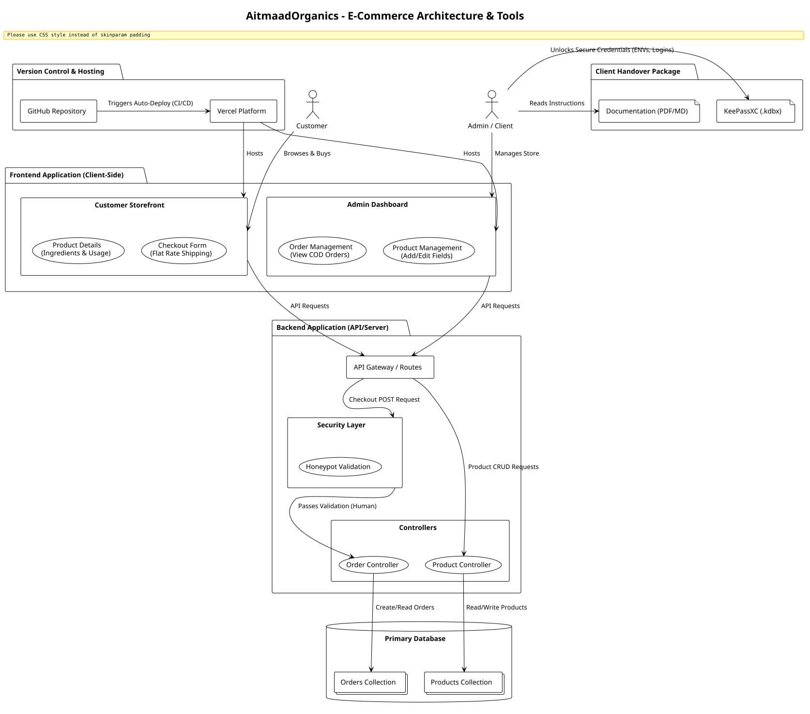
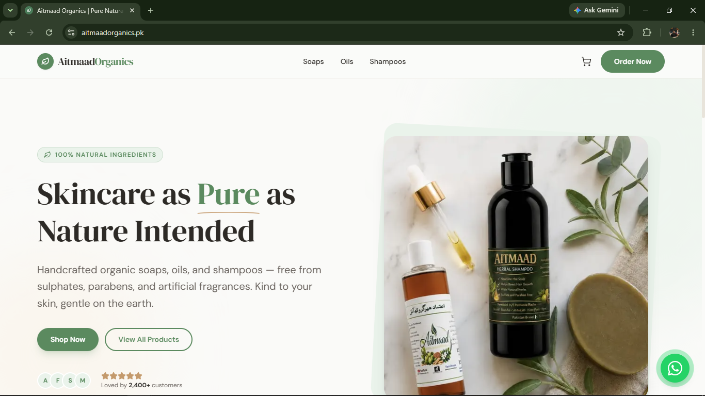
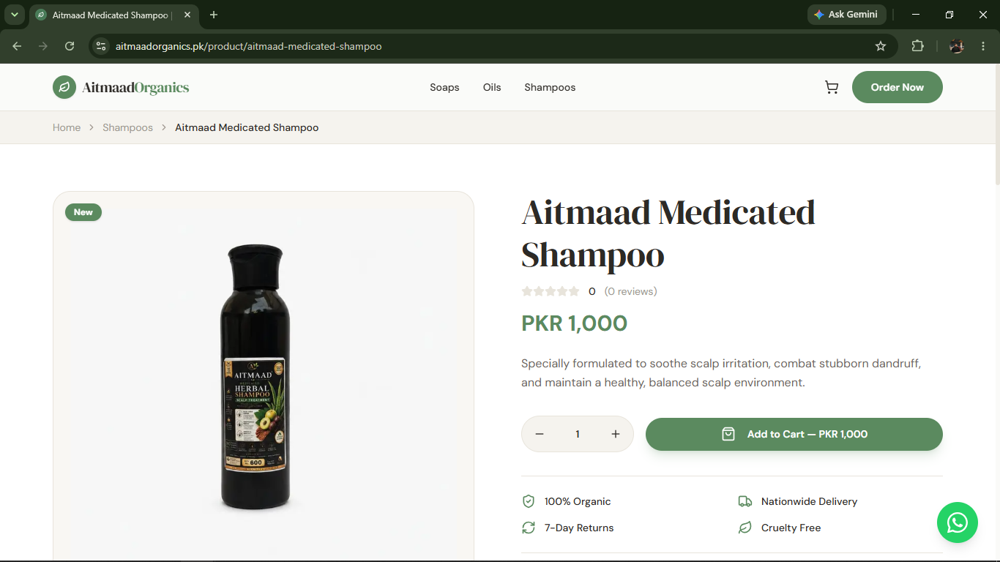
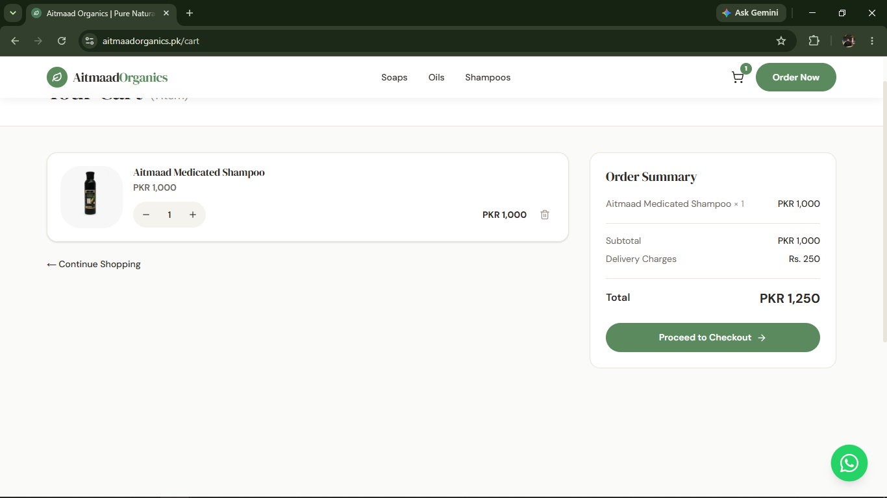

# AitmaadOrganics — E-Commerce Platform

> A modern, full-stack e-commerce web application tailored for organic skincare and haircare products in Pakistan, featuring a custom admin dashboard and Cash on Delivery (COD) integration.


---

## Table of Contents

- [Visual Showcase & System Architecture](#-visual-showcase--system-architecture)
- [Features](#features)
- [Tech Stack](#tech-stack)
- [Project Structure](#project-structure)
- [Getting Started](#getting-started)
- [Environment Variables](#environment-variables)
- [Security](#security)
- [Deployment](#deployment)
- [License](#license)

---

## 📸 Visual Showcase & System Architecture

### 📐 System & Data Architecture
<div align="center">
  
</div>

<br/>

### 🛍️ Storefront & User Experience
| Catalog & Hero Section | Detailed Product View |
| :---: | :---: |
|  |  |

| Cart & COD Checkout Flow | Mobile Responsive UI |
| :---: | :---: |
|  |  |

---

## Features

### 🛍️ Customer-Facing Store
- Browse products by category (Soaps, Oils, Shampoos)
- Full product detail pages with collapsible **Ingredients** and **How to Use** sections
- Persistent shopping cart powered by **Zustand** (survives page refreshes)
- Smooth **checkout flow** with full shipping address collection and flat-rate delivery charges (Rs. 250)
- Customer review & star rating system per product
- Responsive layout — optimised for mobile, tablet, and desktop

### 🔐 Admin Dashboard
- Secure, password-protected admin panel — not linked from the public site
- **JWT authentication** via `HttpOnly` cookies (resistant to XSS)
- **Order Management** — view all incoming COD orders, full customer and shipping details, and update order status through the full lifecycle (*Processing → Confirmed → Shipped → Delivered*)
- **Product Management** — add, edit, or delete products with full control over name, slug, category, price, stock, images, description, **Ingredients**, and **How to Use** fields

### 🛡️ Security
- **Honeypot spam protection** — a hidden field on the checkout form silently rejects automated bot submissions without exposing a CAPTCHA to real users
- **Zod schema validation** on all API routes — prevents NoSQL injection and malformed payloads
- **Request size limits** to prevent oversized payload attacks
- Admin session management with signed JWTs stored in secure, `HttpOnly`, `SameSite=Strict` cookies

---

## Tech Stack

| Layer | Technology |
|---|---|
| **Framework** | [Next.js 16](https://nextjs.org/) (App Router — SSR + API Routes) |
| **UI Library** | [React 19](https://react.dev/) |
| **Language** | [TypeScript 5](https://www.typescriptlang.org/) |
| **Styling** | [Tailwind CSS 4](https://tailwindcss.com/) + Vanilla CSS (custom design tokens) |
| **Database** | [MongoDB Atlas](https://www.mongodb.com/atlas) via [Mongoose 9](https://mongoosejs.com/) |
| **State Management** | [Zustand 5](https://github.com/pmndrs/zustand) (client-side cart) |
| **Validation** | [Zod](https://zod.dev/) (server-side schema validation) |
| **Authentication** | [Jose](https://github.com/panva/jose) (JWT signing & verification) |
| **Icons** | [Lucide React](https://lucide.dev/) |
| **Carousel** | [Embla Carousel React](https://www.embla-carousel.com/) |
| **Animations** | [Framer Motion](https://www.framer.com/motion/) |
| **Deployment** | [Vercel](https://vercel.com/) |

---

## Project Structure

```
AitmaadOrganics/
└── frontend/
    ├── public/                   # Static assets & favicon
    ├── src/
    │   ├── app/
    │   │   ├── (pages)/          # Public routes (home, category, product, cart, checkout, etc.)
    │   │   ├── admin/            # Protected admin dashboard (products, orders)
    │   │   └── api/              # Next.js API route handlers
    │   │       ├── admin/        # Admin-only endpoints (login, products CRUD, orders)
    │   │       ├── orders/       # Customer order submission
    │   │       ├── products/     # Public product fetch endpoints
    │   │       └── cart/         # Cart stock validation
    │   ├── components/           # Shared React components (Navbar, Footer, ProductCard, etc.)
    │   ├── lib/                  # Utilities (db.ts, auth.ts, validate.ts)
    │   ├── models/               # Mongoose schemas (Product, Order, Review)
    │   ├── store/                # Zustand cart store
    │   └── types/                # Shared TypeScript interfaces
    ├── .env.local                # Local environment variables (never commit this)
    ├── next.config.ts
    └── package.json
```

---

## Getting Started

### Prerequisites

- [Node.js](https://nodejs.org/) v18 or higher
- [npm](https://www.npmjs.com/) v9 or higher
- A [MongoDB Atlas](https://www.mongodb.com/atlas) cluster (free tier is sufficient)

### 1. Clone the Repository

```bash
git clone https://github.com/NaveedAhmed5/Aitmaad-E-Commerce-Website-Full-Stack.git
cd Aitmaad-E-Commerce-Website-Full-Stack/frontend
```

### 2. Install Dependencies

```bash
npm install
```

### 3. Configure Environment Variables

Create a `.env.local` file in the `frontend/` directory. See the [Environment Variables](#environment-variables) section below for all required keys.

```bash
cp .env.local.example .env.local
# Then open .env.local and fill in your values
```

### 4. Run the Development Server

```bash
npm run dev
```

The application will be available at **[http://localhost:3000](http://localhost:3000)**.  
The admin panel is accessible at **[http://localhost:3000/admin](http://localhost:3000/admin)**.

---

## Environment Variables

Create a `.env.local` file in the `frontend/` directory with the following variables. **Never commit this file to version control.**

```env
# ── Database ────────────────────────────────────────────────────────────────
# Your MongoDB Atlas connection string
MONGODB_URI=mongodb+srv://<username>:<password>@<cluster>.mongodb.net/<dbname>?retryWrites=true&w=majority

# ── Admin Authentication ─────────────────────────────────────────────────────
# The password used to log in to the Admin Panel
ADMIN_PASSWORD=your_strong_admin_password_here

# Secret key used to sign and verify JWT session tokens (use a long random string)
JWT_SECRET=your_random_secret_key_at_least_32_characters_long

# ── Public API URL (optional for internal API calls) ────────────────────────
NEXT_PUBLIC_API_URL=http://localhost:3000/api
```

> **Note:** In production (Vercel), these variables are set via the Vercel project dashboard under **Settings → Environment Variables**. The `NEXT_PUBLIC_API_URL` should point to your live domain, e.g., `https://your-domain.pk/api`.

---

## Security

This project implements several layers of security beyond standard authentication:

| Mechanism | Implementation |
|---|---|
| **Honeypot field** | A hidden `hp_website_url` input on the checkout form catches bots that auto-fill all fields. Any non-empty submission is silently accepted (fake 200 OK) but not persisted — bots receive no indication they were blocked. |
| **JWT + HttpOnly Cookies** | Admin sessions are stored in `HttpOnly`, `Secure`, `SameSite=Strict` cookies — inaccessible to JavaScript, protecting against XSS-based session theft. |
| **Zod Schema Validation** | Every API endpoint validates its incoming payload against a strict Zod schema, rejecting NoSQL injection objects (`{ "$gt": "" }`) because they fail the `string()` type check. |
| **Request Size Limits** | POST endpoints check `Content-Length` headers and reject payloads above 50 KB. |
| **ObjectId Format Check** | All admin routes that accept a MongoDB `_id` validate its format against a 24-hex-character regex before any database query. |

---

## Deployment

This project is configured for **zero-configuration continuous deployment on [Vercel](https://vercel.com/)**.

Every push to the `main` branch automatically triggers a new production build and deployment.

**To deploy your own instance:**

1. Fork or push this repository to your GitHub account.
2. Go to [vercel.com](https://vercel.com/) and import the repository.
3. Set the **Root Directory** to `frontend`.
4. Add all required [Environment Variables](#environment-variables) in the Vercel dashboard.
5. Click **Deploy**. Vercel will handle everything else.

---

## License

This project is proprietary software developed for **Aitmaad Organics (SMC-Private) Limited**. All rights reserved.

---

## Acknowledgements

Built with care using [Next.js](https://nextjs.org/), [MongoDB Atlas](https://www.mongodb.com/), and deployed on [Vercel](https://vercel.com/).
